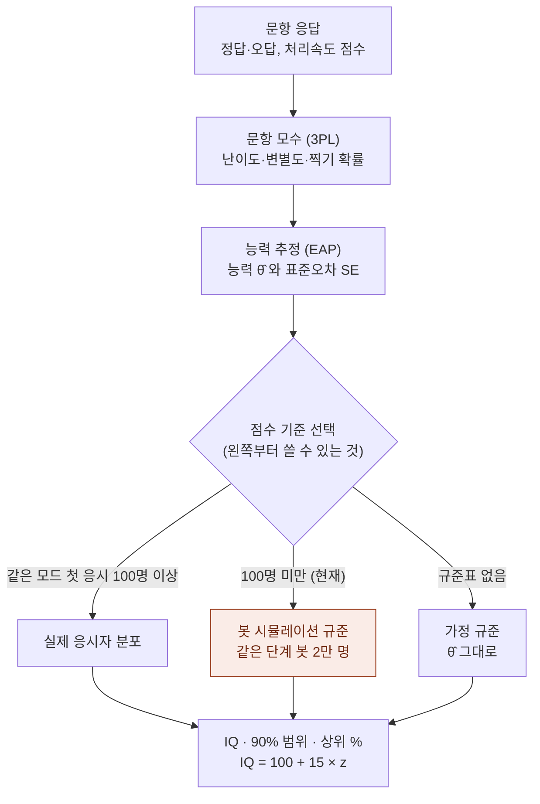
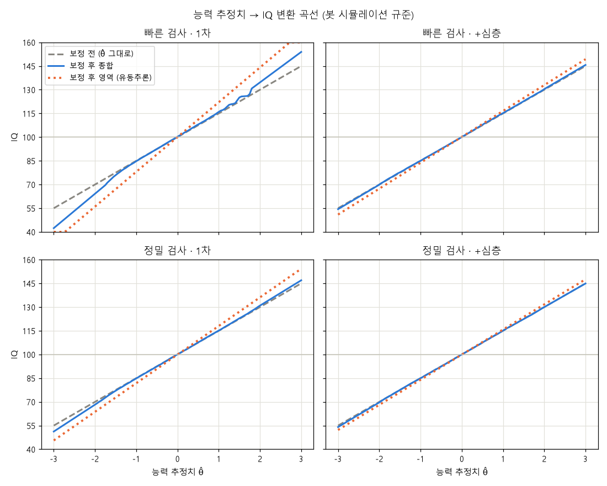
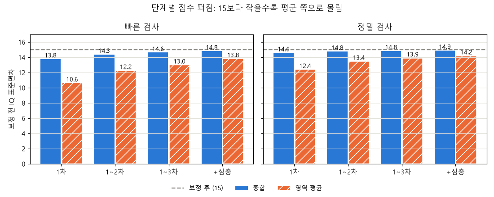

# 07. 채점 원리: 응답에서 IQ가 나오기까지

문항에 답한 결과가 어떤 계산을 거쳐 결과 화면의 **IQ · 90% 범위 · 상위 %** 가 되는지,
그리고 봇 시뮬레이션 데이터가 그 계산의 어디에 쓰이는지를 그림으로 정리했습니다.
수식과 코드 위치는 [05. 개발자 가이드](05_개발자_가이드.md#4-채점-수식-corescoringpy), 수치 검증은 [06. 검증 기록](06_검증기록.md)에 있습니다.

## 1. 전체 흐름



| 단계 | 하는 일 | 코드 |
|---|---|---|
| 문항 응답 | 4지선다·작업기억은 정답/오답, 처리속도는 (맞힌 수 − 틀린 수) | `core/exam.py` `domain_rows` |
| 문항 모수 | 문항마다 "능력이 θ인 사람이 맞힐 확률"을 정함 | `core/scoring.py` `item_params` |
| 능력 추정 | 응답 패턴 전체로 가장 그럴듯한 능력 θ̂와 오차 SE 계산 | `core/scoring.py` `estimate`, `eap` |
| 점수 기준 | θ̂를 "다른 사람들 중 위치(z)"로 바꿈 | `core/scoring.py` `Norm.z`, `SimTable` |
| 결과 | z → IQ, 90% 범위, 상위 % | `core/report.py` `scale` |

## 2. 문항 모수 (3PL)

P(θ) = c + (1 − c) / (1 + e^(−1.7·a·(θ − b)))

| 기호 | 뜻 | 값 |
|---|---|---|
| b (난이도) | 평균 능력(θ=0)인 사람이 예상 정답률만큼 맞히도록 정함 | 쉬움 85% · 보통 65% · 어려움 45% · 매우 어려움 25% |
| a (변별도) | 능력 차이에 정답 확률이 얼마나 민감한지 | 1 (보정값이 있으면 그 값) |
| c (찍기) | 몰라도 맞힐 확률 | 4지선다 0.2 · 작업기억 0 |

관리자 페이지에서 받은 `items/calibration.json`이 있으면 가정값 대신 실제 응답으로 추정한 값을 씁니다.

## 3. 능력 추정 (EAP)

- θ를 −4 ~ 4 사이 161개 점으로 나누고, 점마다 "이 능력이면 지금 응답 패턴이 나올 확률"을 곱합니다.
- 여기에 "사람들 능력은 대체로 평균 근처"라는 사전분포(표준정규)를 곱해 평균을 낸 것이 **θ̂**, 퍼진 정도가 **SE**입니다.
- 어려운 문제를 맞히면 θ̂가 크게 오르고, 쉬운 문제를 틀리면 크게 내려갑니다.
- 문항이 많을수록 SE가 작아집니다. 2·3차 검증과 심층검사를 더 하면 범위가 좁아지는 이유입니다.
- 종합 점수는 모든 영역 문항을 하나의 일반 능력으로 함께 추정합니다.

**문항이 적을 때의 부작용**: 사전분포의 영향으로 θ̂가 평균(0) 쪽으로 끌려옵니다(축소).
문항이 4개뿐인 빠른 검사 영역 점수에서 특히 심합니다. 봇 시뮬레이션 규준은 이 부분을 바로잡으려고 넣었습니다.

## 4. 봇 시뮬레이션 규준

### 만드는 방법

```bash
python scripts/build_sim_norms.py --n 20000 --workers 8   # → norms/sim_norms.json, 약 4분
```

1. 능력 θ가 표준정규분포인 봇을 모드마다 2만 명 만듭니다.
2. 봇이 실제 앱과 같은 출제 로직으로 1·2·3차 검증과 심층검사를 모두 풉니다. 문항마다 3PL 확률대로 맞히거나 틀립니다.
3. 단계(1차 / 1~2차 / 1~3차 / +심층)마다 봇들의 θ̂ 분포를 저장합니다.

### 내 점수에 쓰는 방법

| 점수 | 방법 | 이유 |
|---|---|---|
| 종합 | θ̂가 같은 단계 봇들 중 몇 %에 있는지 → z = Φ⁻¹(백분위) | 분포 모양(찍기 때문에 아래쪽이 눌린 것 등)까지 반영 |
| 영역 | (θ̂ − 봇 평균) / 봇 표준편차 | 영역은 문항이 4~10개라 θ̂가 몇 개 값으로만 나와 백분위가 들쭉날쭉함 |
| 종합의 양 끝 2% | 2~10%(90~98%) 구간의 기울기로 직선 연장 | 만점·0점이 몰려 있어 검사지마다 결과가 갈리는 것을 막음 |

결과 화면의 어느 점수에 어떤 단계를 쓰는지:

| 화면 | 비교하는 단계 |
|---|---|
| 맨 위 IQ, 최종 결과 탭 | 지금까지 마친 단계 (예: 2차까지 했으면 1~2차 봇 분포) |
| 1·2·3차 탭의 차수별 점수 | 1차 (한 차수 분량) |
| 누적 합산 그래프 | 1차 → 1~2차 → 1~3차 → +심층 차례로 |
| 심층검사 영역 그래프 | 출발점은 1~3차, 문항을 푼 뒤부터는 +심층 |

### 변환 곡선



- **회색 점선**: 보정 전 (IQ = 100 + 15·θ̂)
- **파란 선**: 보정 후 종합. 회색 선과 거의 겹칩니다. 종합 점수는 원래도 정확했다는 뜻입니다.
  빠른 검사 1차 위쪽의 작은 계단은 만점 근처 점수가 몇 개 값에 몰려 생기는 것으로, 크기는 2~3점입니다.
- **주황 점선**: 보정 후 영역. 빠른 검사 1차에서 기울기가 가장 가파릅니다. 같은 θ̂라도 더 넓게 펼칩니다.
- 심층검사까지 하면 세 선이 거의 하나로 모입니다. 문항이 많아질수록 원래 추정이 정확해져 보정할 것이 줄어듭니다.

### 단계별로 얼마나 보정되나



IQ의 정의는 "평균 100, 표준편차 15"입니다. 보정 전 점수의 표준편차가 15보다 작으면 점수가 평균 쪽으로 몰려 있다는 뜻이고,
보정 후에는 모두 15로 맞춰집니다.

## 5. 예시: 빠른 검사, 능력 추정치 θ̂ = 1.0

| 마친 단계 | SE (예) | 보정 전 종합 | 보정 후 종합 | 상위 | 유동추론 영역 (보정 전 → 후) |
|---|---|---|---|---|---|
| 1차 | 0.42 | 115 (105~125) | 116 (105~126) | 14% | 115 → 122 |
| 1~3차 | 0.27 | 115 (108~122) | 115 (109~122) | 15% | 115 → 118 |
| +심층 | 0.20 | 115 (110~120) | 115 (110~120) | 16% | 115 → 117 |

(영역 SE는 0.55로 가정)

- 종합 점수는 거의 그대로이고, 범위가 단계마다 좁아집니다.
- 영역 점수는 1차에서 7점 올라갑니다. 4문항으로 θ̂ = 1.0이 나왔다는 것은 같은 1차를 푼 사람들 중에서는 실제로 더 높은 위치라는 뜻이기 때문입니다.

## 6. 마지막 계산: IQ · 90% 범위 · 상위 %

| 항목 | 계산 |
|---|---|
| IQ | 100 + 15 × z (40 ~ 160으로 제한) |
| 90% 범위 | θ̂ − 1.645·SE 와 θ̂ + 1.645·SE 를 각각 같은 기준으로 z로 바꾼 뒤 IQ로 |
| 상위 % | 100 − Φ(z) × 100 |
| 수준 | 130 이상 매우 우수 · 120~129 우수 · 110~119 평균 상 · 90~109 평균 · 80~89 평균 하 · 70~79 낮음 · 69 이하 매우 낮음 |

봇 실험에서 실제 능력이 90% 범위 안에 들어간 비율은 모든 단계에서 89.8~90.5%였습니다.

## 7. 한계

- 봇은 **문항 난이도 가정대로** 답합니다. 규준표는 "가정이 맞다면"의 분포입니다.
- 문항 난이도(`expected_p`, `calibration.json`), 검사 구성, 심층검사 규칙을 바꾸면 규준표와 이 문서의 그래프를 다시 만들어야 합니다.
  ```bash
  python scripts/build_sim_norms.py --n 20000 --workers 8
  python scripts/plot_norm_curves.py   # 그래프 (matplotlib 필요)
  ```
- 보정은 개인 점수의 정밀도를 높이지 않습니다. 빠른 1차는 참값과의 오차가 ±6.1에서 ±6.4점으로 조금 늘어납니다.
  더 정확한 점수는 2·3차와 심층검사로 얻습니다.
- 같은 모드의 실제 첫 응시자가 100명을 넘으면 기준이 자동으로 실제 분포로 바뀝니다.
