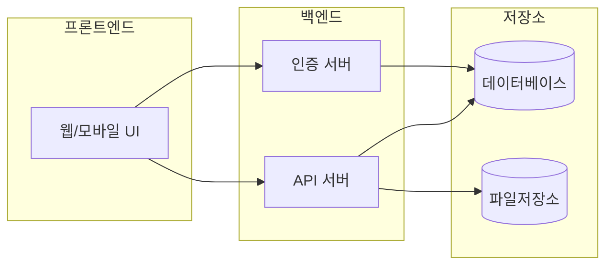
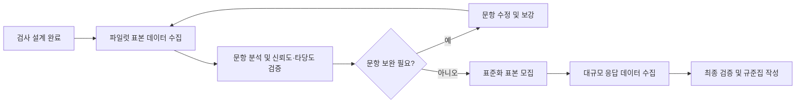

# IQ 테스트 프로그램 개발 분석 보고서

본 보고서는 **IQ 테스트 프로그램** 개발에 필요한 요소를 심층 분석하고 권장사항을 제시한다. 심리측정학적 기준(신뢰도·타당도·표준화)과 문항 유형(언어·수리·공간·작업기억 등), 채점 규칙(원점수→표준점수 변환, 연령·교육별 보정), 문항은행 설계(메타데이터·적응형 테스트 고려), 데이터 수집·저장·보안(한국 개인정보보호법 준수), 법적·윤리적 고려사항(저작권·사용자 동의), 기술 요구사항(백엔드·프론트엔드·DB·인프라·모바일·오프라인) 등을 다룬다. 또한 MVP 기능 목록과 우선순위, 개발 로드맵, 테스트·검증 계획, 배포·운영 전략, 예상 리스크와 완화책을 포함한다. 각 항목별 **분석·권장사항·구현 체크리스트**를 제공하여 종합적인 가이드라인을 제시한다.

## 심리측정학 기준 (신뢰도·타당도·표준화)

검사의 **신뢰도**는 반복 측정 시 결과의 일관성을, **타당도**는 검사 도구가 의도한 능력을 정확히 측정하는 정도를 의미한다. 한 연구에 따르면 한 심리검사의 내적일관성 신뢰도는 0.80 이상으로 높게 나타났고, 구성개념 타당도 역시 기준치를 충족했다. 표준화 절차에서는 다양한 연령·성별·배경을 대표하는 표본(예: N≥1,000)을 통해 규준집을 구축해야 한다. 예를 들어 K-WAIS-IV 표준화집단(N=1,228명)을 기반으로 표준점수를 산정한 바 있다.

**권장사항:** 검사 신뢰도는 Cronbach’s α ≥ 0.7~0.8 이상을 목표로 설정하고, 파일럿 검사를 통해 재검사 신뢰도나 내적 일관성을 검증한다. 내용타당도(전문가 검토)와 요인분석·준거타당도 분석을 통해 다차원 타당도를 확보해야 한다. 표본은 인구통계적 특성을 반영하여 모집하고, 표준점수(평균100, SD15) 변환 로직을 구현한다. 연령·성별·학력별 규준표를 만들어 결과 해석 시 보정한다.

**구현 체크리스트:**  
- 문항 내용 검토를 통한 내용타당도 확보  
- 파일럿 테스트로 신뢰도(α, 재검사) 산출  
- 요인분석 및 준거타당도 검증  
- 대표 표본 모집(성별·연령별 층화표집) 및 표준화 수행  
- 원점수→IQ 점수 변환 로직(평균100, SD15) 구현  

## 문항 유형 및 난이도 분포

IQ 검사는 일반적으로 **언어적 능력**(어휘, 유추 등), **수리적 능력**(산수, 문제풀이 등), **공간적 능력**(행렬추론, 도형배치 등), **작업기억·처리속도**(숫자암기, 기호쓰기 등) 영역을 측정한다. 각 유형별 문항 수와 난이도를 균형 있게 설계해야 한다. 예를 들어, K-WAIS-IV 단축형 연구에서는 상식(Information), 행렬(Matrix), 산수(Arithmetic), 기호쓰기(Symbol Search) 등의 하위검사를 사용했다. WAIS-IV 정보 소검사는 26문항, 산수 소검사는 22문항으로 구성된다. 

**권장사항:** 언어·수리·공간·기억 등 주요 영역별 대표 문항(어휘, 산수 문제, 도형추리, 숫자암기 등)을 충분히 확보한다. 문항 난이도는 쉬운 문제(정답률 높음)와 어려운 문제(정답률 낮음)를 고루 배분해 전체 난이도 분포를 설정한다. 각 문항에 예상 소요시간, 정답률 목표치를 할당하여 난이도 조정 기준으로 삼는다.

**구현 체크리스트:**  
- 언어(어휘, 독해), 수리(산수, 계산), 공간(행렬추론, 도형배치), 작업기억(숫자암기) 등 영역별 문항 수 설정  
- 각 문항의 난이도(쉬움·보통·어려움) 태그 지정  
- 문항별 예시 답안/해설 작성 및 표본문항 확보(영역당 20~30문항 권장)  
- 출제위원 검토를 통해 난이도·문항내용 검증  

## 채점 규칙 (원점수→표준점수 변환, 연령·교육 보정)

응시자의 **원점수(raw score)**를 표준점수로 변환해 해석한다. 현대 IQ 검사에서는 원점수를 평균 100, 표준편차 15인 정규분포로 변환한다. 이렇게 하면 인구집단에서의 상대적 위치(예: 상위 2% 이상)를 나타낼 수 있으며, IQ 85–115 구간에 약 68%가 속하게 된다. 연령별 규준집을 별도로 마련하여 같은 연령대 평균을 기준으로 점수를 보정한다. 예를 들어 동일 연령대 평균 IQ를 100으로 보고, 해당 연령의 점수 분포를 적용해야 한다.

**권장사항:** 먼저 원점수를 Z점수로 변환한 뒤 T점수(평균50, SD10) 또는 IQ(평균100, SD15)로 환산한다. 연령/학년별 규준표를 제작하여, 응시자의 실제 연령대 또는 학력대 평균과 비교하도록 한다. 검사 결과를 백분위(percentile)로도 제공하면 해석이 용이하다.

**구현 체크리스트:**  
- 원점수→Z점수 변환 함수 구현  
- T점수(μ=50,σ=10) 및 IQ점수(μ=100,σ=15) 산출 공식 구현  
- 연령/학년별 표준점수 규준표 준비  
- 백분위 환산 로직 구현  
- 연령별 표준점수 보정 처리  

## 문항은행 설계 (메타데이터·적응형 테스트)

문항은행에 **메타데이터**(난이도, 변별도, 영역, 태그, 작성자 등)를 포함하여 관리한다. 문항반응이론(IRT)을 적용해 각 문항의 모수(난이도·변별도)를 추정하면, 적응형 검사(CAT) 구현이 가능해진다. 예를 들어 각 문항에 IRT 2PL 모델을 적용하면 응시자의 능력 수준에 맞춰 다음 문항을 선택할 수 있다. 문항 데이터베이스는 버전관리·접근통제와 연동하여 보안도 강화해야 한다.

**권장사항:** 문항 데이터베이스 스키마에 `문항ID, 문항문구, 정답, 영역태그, 난이도점수, 변별도, 작성연도, 출처` 등 필드를 정의한다. 초기 단계에서 충분한 문항을 확보한 후 파일럿 테스트로 난이도 및 변별도를 산정한다. 적응형 검사 도입 시, 1PL/2PL/3PL 모델 중 필요한 모델을 선정하고 알고리즘(난이도 기준 문항 선택, 추정 치 사용)을 명문화한다.

**구현 체크리스트:**  
- 문항 필드 정의(예: ID, 본문, 정답, 영역, 난이도, 키워드 등)  
- 문항 메타데이터(작성자, 작성일, 검토일 등) 관리  
- 문항 난이도·변별도 산출(고전검사이론/IRT 적용)  
- CAT 설계 여부 결정 및 알고리즘 구현(실행 흐름 설계)  
- 문항 갱신·검토 프로세스 마련(버전관리, 변경이력 기록)  

## 데이터 수집·저장·보안·개인정보보호

프로그램은 **개인정보 보호법**을 준수해야 한다. 검사 결과 데이터는 개인정보(이름, 생년월일 등)와 민감정보(심리검사 결과가 건강정보로 분류될 수 있음)로 간주될 수 있다. 따라서 응시 전 반드시 개인정보 수집·이용에 대한 *명시적 동의*를 받아야 하며, 개인정보 처리방침을 고지해야 한다. 저장 시에는 **암호화**(예: 데이터베이스 필드 암호화, TLS 암호화)와 접근권한 관리 등 기술적 조치를 이행해야 한다. 개인정보보호법 제23조는 건강정보 등 민감정보의 처리를 제한하며, 별도 동의 시 처리가 가능하므로 관련 규정을 반드시 준수한다.

**권장사항:** 개인정보처리방침을 수립하여 수집 목적·보유 기간·파기 방법을 명시한다. 데이터베이스에는 AES 등 암호화 알고리즘을 적용하고, 전송 시 HTTPS/TLS를 사용한다. 백업 데이터도 암호화 또는 가명처리하여 보관한다. 클라우드/서버 접근은 최소 권한 원칙으로 설정하고, 모든 접근 로그를 모니터링한다.

**구현 체크리스트:**  
- 개인정보 수집·이용 동의서 및 처리방침 작성  
- 데이터베이스 암호화 설정(예: AES-256)  
- SSL/TLS 적용, 방화벽·IDS 구성  
- 사용자 인증 및 권한관리 로직 구현  
- 정기적 보안 점검 및 침투 테스트 수행  

## 법적·윤리적 고려사항 (저작권·사용자 동의)

검사용 문항과 콘텐츠는 **저작권 보호 대상**이다. WAIS, Stanford-Binet 등 상용 검사 문항을 사용할 경우 출판사와 사용 계약을 체결해야 하며, 자체 제작 시에도 무단 복제나 표절을 피해야 한다. 검사 전 응시자에게 검사 목적, 내용, 소요 시간, 결과 활용 범위를 설명하고 **서면 동의**를 받아야 한다. 검사 후 점수 해석에 대한 책임 소재 및 사용 제한(예: 학업배치용 한정)도 명시한다. 검사의 윤리적 사용(예: 전문가 감독, 사후 상담 안내)을 위해 관련 지침을 마련한다.

**권장사항:**  
- 문항 저작권 확인 및 필요 시 라이선스 계약 체결.  
- 검사 참여자에게 개인정보·결과 활용 동의서를 제공하고 서명 받기.  
- 검사 안내문에 소요 시간, 부정행위 방지 정책, 사용범위 등을 명기.  
- 심리검사 윤리지침(예: 결과 보고 시 전문가 개입) 검토 및 준수.

**구현 체크리스트:**  
- 사용 문항의 저작권 확인(상용 문항 사용 시 계약 여부)  
- 검사 동의서 및 약관 안내 기능 구현  
- 검사 시작 전 동의 확인 UI/절차 구현  
- 테스트 운영 중 윤리규정(공정성, 평등성) 준수 여부 점검  

## 기술 요구사항 (백엔드·프론트엔드·DB·인프라·모바일·오프라인)

이 서비스는 웹 및 모바일 환경을 모두 지원해야 하며, **확장성**과 **보안**을 고려한 아키텍처가 필요하다. 

- **백엔드:** Node.js(Express), Python(Django/Flask) 등 안정적인 서버 프레임워크를 사용해 RESTful API를 제공한다. 인증/인가(OAuth2/JWT)와 로깅 기능을 포함한다.  
- **프론트엔드:** React, Vue.js, Angular 등 모던 UI 프레임워크로 반응형 웹 애플리케이션을 구현한다. 사용자 경험(UX)과 접근성(Accessibility)을 고려한다.  
- **데이터베이스:** PostgreSQL/MySQL(관계형) 또는 MongoDB(문서형) 중 선택한다. ACID 속성을 고려하되, JSON 형태 설문 등을 다룰 경우 NoSQL도 검토한다. 개인정보 필드는 암호화 저장한다.  
- **인프라:** AWS, Azure, GCP 또는 국내 클라우드(NCP, KT 등)를 활용하여 고가용성을 확보한다. Docker/Kubernetes 등 컨테이너 기반 서비스를 도입하고, 필요시 오토스케일링을 구성한다.  
- **모바일:** 기본은 반응형 웹이나 PWA로, 네이티브 앱(React Native, Flutter) 개발도 검토한다. 오프라인 모드를 지원하려면 로컬 저장(IndexedDB, SQLite)과 동기화 로직이 필요하다.  
- **오프라인:** 네트워크 단절 시에도 최소한의 검사가 가능하도록 PWA 캐싱, 로컬 DB(IndexedDB) 등을 구성한다.

| 컴포넌트    | 기술 예시                            | 고려사항                            |
|-------------|--------------------------------------|-------------------------------------|
| 백엔드      | Node.js(Express), Python(Django)      | 확장성, 인증·인가, 로깅             |
| 프론트엔드  | React, Vue.js                         | 반응형 UI, 접근성                   |
| 데이터베이스 | PostgreSQL, MySQL, MongoDB            | ACID/스케일, 암호화, 백업/복구      |
| 인프라      | AWS, Azure, GCP, NCP 클라우드         | 멀티AZ, 오토스케일링, 비용관리      |
| 모바일      | React Native, Flutter, 네이티브 앱    | 오프라인 지원, 화면 최적화         |
| 오프라인    | PWA(IndexedDB), 모바일 로컬 DB        | 네트워크 장애 시 데이터 동기화      |

아래 mermaid 다이어그램은 사용자, 프론트엔드, 백엔드, 데이터 저장소 간의 시스템 구조를 나타낸다.



**권장사항:** SSL/TLS를 적용하여 통신 보안을 확보하고, 컨테이너화 및 CI/CD를 통한 자동 배포 체계를 구축한다. 애플리케이션 성능 모니터링(APM), 로그 분석 도구(ELK/Grafana) 등을 도입한다. 정기적인 보안 패치와 서비스 장애 복구 계획(DR)도 마련한다.

**구현 체크리스트:**  
- 백엔드/프론트엔드 프레임워크 및 개발환경 설정  
- REST API 및 인증/인가 구현  
- 데이터베이스 스키마 설계 및 암호화 구현  
- CI/CD 파이프라인 구축(GitHub Actions, Jenkins 등)  
- 모바일 반응형 UI 및 PWA/앱 테스트  

## MVP 기능 목록 및 우선순위

초기 **MVP(최소기능제품)**에는 다음 기능을 포함한다(우선순위 순):  
1. **사용자 인증·관리:** 회원가입/로그인, 프로필 관리, 역할(관리자/응시자) 구분.  
2. **검사 관리:** 관리자용 문항·검사지 생성·편집 화면(문항 CRUD, 검사지 템플릿).  
3. **문항은행 관리:** 문항 메타데이터 관리, 문항 검토 워크플로, 버전관리.  
4. **검사 응시 인터페이스:** 응시자용 검사지 제공(UI, 타이머, 탐색), 답안 입력 기능.  
5. **자동 채점 및 점수 산출:** 정답 확인, 원점수 계산, 표준점수 변환 로직.  
6. **결과 리포트:** IQ 점수 및 백분위, 영역별 점수, 그래프 시각화 제공.  
7. **데이터 저장·조회:** 응시 결과의 안전한 저장 및 관리자/사용자용 조회 기능.  
8. **보안·동의 기능:** SSL 적용, 개인정보 동의서 UI, 약관 동의 처리.  
9. **모바일 지원:** 반응형 웹 또는 간단한 앱으로 접근 지원.  
10. **오프라인 모드(선택):** 네트워크 없이도 검사가 가능하도록 PWA 오프라인 기능.  
11. **분석 대시보드(선택):** 관리자용 응시 통계, 문항분석 대시보드.  
12. **다국어 지원(선택):** 한국어 외 영어 등 추가 언어 선택.  

우선순위는 비즈니스 목표와 리소스에 맞게 조정하며, 핵심 기능부터 단계적으로 구현한다.

## 개발 로드맵 (단계별 일정·인력·예산)

개발 단계별 일정 예시를 아래 표에 제시한다. 인력과 예산 항목은 결정 전까지 **미지정**으로 둔다.

| 단계              | 기간(예상)  | 인력(명) | 예산(원) |
|------------------|------------|--------|--------|
| 기획·요구분석     | 1~2개월     | 미지정   | 미지정  |
| UI/UX 설계        | 1개월       | 미지정   | 미지정  |
| 핵심 개발 (1차)   | 3~4개월     | 미지정   | 미지정  |
| 추가 개발 (2차)   | 2~3개월     | 미지정   | 미지정  |
| 테스트·검증       | 1~2개월     | 미지정   | 미지정  |
| 배포·런칭         | 1개월       | 미지정   | 미지정  |
| 운영·유지보수 준비 | 지속        | 미지정   | 미지정  |

각 단계는 필요에 따라 중첩 병행할 수 있으며, Agile 방식으로 세부 스프린트 계획을 수립한다.

## 테스트·검증 계획 (파일럿·표준화 표본 설계)

파일럿 테스트와 표준화 조사를 통해 검사의 품질을 검증한다. 소규모 **파일럿 표본**(예: N=100~200)을 모집하여 응시 데이터를 수집하고, 문항분석(난이도·변별도)과 신뢰도(Cronbach’s α)·타당도 분석을 수행한다. 문항별 문제가 발견되면 수정 및 보완한다. 이후 **대규모 표준화 표본**(층화표집, 예: N≥1,000)을 모집하여 최종 규준집을 구축한다. 절차를 아래 flowchart로 요약한다.



**권장사항:** 파일럿 단계에서는 동일 환경(PC/모바일 등)에서 검사하고, 사후 피드백 설문을 함께 실시하여 문제점을 파악한다. 표준화 표본은 통계적 대표성을 확보하고, 필요 시 표본 가중치를 고려한다. 모든 검증 절차를 문서화하여 재현 가능토록 한다.

**구현 체크리스트:**  
- 파일럿 설계(표본 기준, 윤리승인) 및 검사 시행  
- 문항 분석(난이도·변별도), 신뢰도(α) 및 타당도 검증  
- 문항 수정/삭제 후 반복 검증  
- 표준화 표본 설계(층화표집), 대규모 데이터 수집  
- 최종 신뢰도·타당도 재검증 및 규준집 작성  

## 배포·운영·유지보수 전략

서비스 배포 후에는 **CI/CD** 기반 자동화 파이프라인으로 일관된 배포·테스트를 실시한다. 실시간 **모니터링**(성능, 오류 로그, 사용자 행태) 체계를 구축하여 장애와 문제를 신속히 탐지·대응한다. 정기적인 **백업** 및 **장애복구(DR)** 계획을 수립하고, 보안 패치도 즉시 적용한다. 사용자 지원을 위해 도움말, FAQ, 기술 지원 채널을 마련하며, 사용자 피드백을 반영해 UI/UX와 문항은행을 지속 개선한다. 운영 중에는 데이터베이스 최적화(인덱싱, 아카이빙)도 검토한다.

**구현 체크리스트:**  
- CI/CD 도구 설정(GitHub Actions 등)  
- 모니터링/로깅 시스템 구축(ELK/Grafana/CloudWatch 등)  
- 데이터 백업/복구 절차 수립  
- 사용자 문서(매뉴얼, FAQ) 준비  
- 정기 업데이트 및 보안 정책 시행  

## 예상 리스크 및 완화책

- **데이터 유출/보안 사고:** 개인정보 유출로 법적 문제가 발생할 수 있다. 완화책: 강력한 암호화(단방향 해시) 및 접근통제, 정기 보안 점검, 사고 대응 계획 수립.  
- **측정 오차·편향:** 불충분한 문항이나 편향된 표본은 신뢰도·타당도를 떨어뜨린다. 완화책: 충분한 표본으로 파일럿 실시, 문항 품질 검증, 분석 후 문제 문항 교체.  
- **법적·윤리적 위반:** 저작권 무단 사용, 동의 미비는 법적 처벌 대상이다. 완화책: 문항 저작권 확인 및 계약, 동의서 및 약관 철저 준비.  
- **시스템 장애/성능 문제:** 동시 접속 폭주나 서버 오류. 완화책: 부하 테스트, 오토스케일링, 이중화 아키텍처 설계.  
- **사용자 반응 부진:** 사용성 불편, 결과 불만족. 완화책: 사용자 테스트로 UI 개선, 결과 해석을 명확히 제공.  
- **일정 지연:** 기능 과다, 리소스 부족. 완화책: 애자일 방식으로 우선순위 조정, 핵심 기능부터 단계적 개발.

위 리스크는 초기 기획 단계부터 지속 모니터링하고, 예방·대응 방안을 수립하여 프로젝트를 안정적으로 추진한다.

# JSON 구조화 객체

```json
{
  "executive_summary": "본 보고서는 IQ 테스트 프로그램 개발에 필요한 주요 요소를 분석하고 권장사항을 제시한다. ... (중략) ... IQ 테스트 프로그램 구축을 위한 종합적인 가이드라인을 제시한다.",
  "sections": {
    "psychometrics": {
      "analysis": "신뢰도와 타당도는 검사 문항의 일관성과 측정의 정확성을 판단하는 기준이다. ... 규준집을 구축해야 한다.",
      "recommendations": [
        "검사 신뢰도는 Cronbach’s α ≥ 0.7~0.8 이상을 목표로 한다.",
        "내용·구성·준거타당도 증거를 수집하기 위해 전문가 검토와 요인분석을 수행한다.",
        "다양한 특성의 대표 표본을 통해 표준화를 실시하고, 표준점수(평균100, SD15)로 변환한다.",
        "연령·성별·학력별 규준표를 마련해 결과 해석 시 보정한다."
      ],
      "checklist": [
        "문항 내용 검토 및 내용타당도 확보",
        "파일럿 테스트를 통한 신뢰도(재검사, Cronbach’s α) 산출",
        "요인분석과 준거타당도 분석 실시",
        "대표성 있는 표준화 표본(예: N≥1,000) 확보 및 난이도 조정",
        "원점수→IQ 점수 변환 로직 및 표준점수 계산식 구현"
      ]
    },
    "item_types": {
      "analysis": "IQ 검사는 일반적으로 언어적 능력(어휘, 유추 등), ... 22문항으로 설계되어 있다.",
      "recommendations": [
        "언어, 수리, 공간, 기억 등 주요 영역을 커버하는 문항을 충분히 확보한다.",
        "쉬움·중간·어려움 난이도의 문항을 적절히 배분하여 난이도 분포를 조정한다.",
        "문항마다 소요시간과 정답률을 예측하여 타당한 배점을 설정한다.",
        "각 유형별 예시 문항(문항 샘플)을 제작하여 검토한다."
      ],
      "checklist": [
        "언어(어휘, 독해), 수리(산수, 문제풀이), 공간(도형추리), 작업기억(숫자암기) 등 영역별 문항 수 결정",
        "각 문항의 난이도(쉬움/보통/어려움) 태그 지정",
        "문항별 예시 답안과 해설 준비",
        "출제위원 검토를 통해 난이도·문항내용 검증",
        "문항 유형별 표본(예: 영역당 20~30문항) 확보"
      ]
    },
    "scoring": {
      "analysis": "응시자의 원점수를 적절한 규준에 따라 변환해야 한다. 현대 IQ 검사에서는 ... 점수를 보정해야 한다.",
      "recommendations": [
        "원점수를 Z점수 및 T점수(평균50, SD10)로 변환한 후, IQ 점수(평균100, SD15)를 계산한다.",
        "각 연령/학년별 규준표를 개발하여, 같은 연령대의 평균 대비 편차를 반영한다.",
        "백분위수나 백분점수(percentile) 등도 함께 제공한다.",
        "교육 수준에 따른 보정 필요 여부를 검토한다."
      ],
      "checklist": [
        "원점수→Z점수 변환 함수 구현",
        "T점수(μ=50,σ=10)와 IQ점수(μ=100,σ=15) 산출 공식 구현",
        "연령/학년별 표준점수 규준표 준비",
        "백분위 환산 및 점수표(Percentile table) 구축",
        "점수 해석 가이드라인 문서화"
      ]
    },
    "item_bank": {
      "analysis": "문항은행에는 각 문항의 난이도, 변별도, ... 버전관리와 접근 권한 제어도 함께 고려한다.",
      "recommendations": [
        "문항 데이터베이스 필드에 ID, 영역(tag), 난이도, 변별도, 정답, 해설, 출처 등을 명시한다.",
        "초기 문항충분(pool)을 확보한 후 파일럿으로 문항 파라미터(IRT a/b값)를 추정한다.",
        "동형문항과 적응형 알고리즘(1PL/2PL 모델 등) 기획을 문서화한다.",
        "문항 리뷰 및 업데이트 주기를 설정하여 문항의 최신성과 타당도를 유지한다."
      ],
      "checklist": [
        "문항 스키마 설계(예: ID, 텍스트, 정답, 영역, 난이도, 키워드 등)",
        "문항 메타데이터(출처, 제작자, 작성일, 검토일) 관리",
        "문항 난이도·변별도 계산 로직 구현(CTT 또는 IRT 활용)",
        "CAT 설계 여부 판단 및 알고리즘 초안 작성",
        "문항 리뷰 워크플로 및 버전관리 시스템 구축"
      ]
    },
    "data_security": {
      "analysis": "프로그램은 개인정보 보호법 등 관련 법규를 준수해야 한다. 검사 데이터는 개인정보 ... 기술적 조치를 이행해야 한다.",
      "recommendations": [
        "개인정보 처리방침을 수립하여 수집 목적·항목·보유 기간 등을 명시한다.",
        "서버·DB에 저장되는 개인정보는 암호화(필드 암호화 혹은 디스크 암호화)한다.",
        "네트워크 통신은 HTTPS(TLS)로 보호하고, 서버는 방화벽·IDS 등을 통해 보호한다.",
        "개인정보 접근 권한을 최소화하고, 접근 로그를 주기적으로 모니터링한다."
      ],
      "checklist": [
        "개인정보 수집·이용 동의서 및 처리방침 문서화",
        "데이터베이스 암호화 설정(예: AES 암호화)",
        "HTTPS 적용 및 SSL/TLS 인증서 설치",
        "사용자 인증·권한부여 로직 구현",
        "정기적인 보안 점검(취약점 스캔, 펜테스트 등)"
      ]
    },
    "legal_ethics": {
      "analysis": "지능검사 문항은 저작권 보호 대상이므로, ... 검사 전 응시자에게 검사 목적·방법·결과 활용 범위를 설명하고 서면 동의를 받아야 한다.",
      "recommendations": [
        "검사용 문항의 저작권 상태를 확인하고, 필요한 경우 사용 허가를 받는다.",
        "검사 동의서(개인정보 및 검사 결과 처리 동의)를 설계하고, 검사 시작 전 필수 서명 절차를 구현한다.",
        "응시자 안내문에 검사 소요 시간, 난이도 수준, 부정행위 방지 정책 등을 명시한다.",
        "심리평가 윤리지침(예: 전문가 감독, 사후 상담 제공)을 준수한다."
      ],
      "checklist": [
        "사용할 문항의 저작권 라이선스 확인(상업용 문항 사용시 계약 체결)",
        "사용자 동의서 및 개인정보처리방침 승인절차 구현",
        "검사 안내 화면에 이용 약관 및 동의 사항 표시",
        "윤리규정 준수 여부 검토(예: 응시결과 비공개 설정 등)"
      ]
    },
    "tech_requirements": {
      "analysis": "시스템은 웹 및 모바일 환경을 지원하며 ... 반응형 웹 또는 React Native/Flutter 기반 앱 구현을 고려하며, 오프라인 검사 가능성을 검토한다.",
      "recommendations": [
        "SSL/TLS를 적용하여 데이터 전송을 보호한다.",
        "컨테이너(Docker/Kubernetes)를 이용해 배포 자동화와 오토스케일링을 도입한다.",
        "성능 모니터링 및 로깅 도구(New Relic, ELK, CloudWatch 등)를 활용한다.",
        "정기적인 보안 업데이트와 패치 관리를 수행한다."
      ],
      "checklist": [
        "백엔드 및 프론트엔드 프레임워크 선정 및 개발환경 구축",
        "REST API 및 인증(OAuth2/JWT 등) 설계·구현",
        "데이터베이스 스키마 설계 및 백업 정책 수립",
        "CI/CD 파이프라인 도구 설정(예: GitHub Actions, Jenkins)",
        "모바일 및 웹 UI 반응형 테스트"
      ]
    },
    "MVP": {
      "analysis": "프로젝트 초기에 구현할 핵심 기능을 정의한다.",
      "recommendations": [],
      "checklist": [
        "사용자 인증(로그인/회원가입) 기능 구현",
        "검사 관리(문항 및 검사 생성·편집) 기능 개발",
        "응시자용 검사 화면 및 답안 입력 기능 구현",
        "자동 채점 로직 및 원점수 계산 기능 구현",
        "IQ 점수 및 통계가 포함된 결과 보고서 생성",
        "문항과 결과 데이터를 안전하게 저장·조회하는 기능 마련",
        "보안(SSL, 인가) 및 법적 동의 절차 포함"
      ]
    },
    "roadmap": {
      "analysis": "개발 로드맵은 기획, 설계, 개발, 테스트, 배포·운영 단계로 구성할 수 있다.",
      "recommendations": [],
      "checklist": [
        "기획 및 요구사항 분석 (기간: 1~2개월)",
        "UI/UX 설계 (기간: 1개월)",
        "핵심 기능 개발 (기간: 3~4개월)",
        "추가 기능 개발 (기간: 2~3개월)",
        "테스트 및 검증 (기간: 1~2개월)",
        "배포 및 런칭 (기간: 1개월)",
        "운영 및 유지보수 준비 (지속)"
      ]
    },
    "testing": {
      "analysis": "파일럿 테스트와 표준화 조사를 통해 검사의 신뢰도 및 타당도를 검증한다.",
      "recommendations": [
        "파일럿 표본을 모집하여 문항분석 및 신뢰도 검증을 실시한다.",
        "문항 분석 결과에 따라 문항을 수정·보완한 후, 대규모 표준화 조사를 수행한다.",
        "모든 검증 절차를 문서화하여 재현 가능하도록 한다."
      ],
      "checklist": [
        "파일럿 표본(예: N=100~200) 모집 및 검사 실시",
        "문항 난이도·변별도 분석 및 신뢰도(α) 계산",
        "필요시 문항 수정·삭제 후 재검증",
        "표준화 표본 설계(층화표집) 및 대규모 데이터 수집",
        "최종 검증(신뢰도·타당도) 및 규준집 작성"
      ]
    },
    "deployment": {
      "analysis": "배포 후 안정적 운영을 위해 CI/CD, 모니터링, 백업 및 사용자 지원 체계를 구축해야 한다.",
      "recommendations": [
        "자동화된 배포 파이프라인(CI/CD)을 설정하여 일관된 배포 프로세스를 유지한다.",
        "로그 및 성능 모니터링 시스템을 도입하여 이상 징후를 즉시 탐지한다.",
        "정기적인 백업 정책과 장애 복구 매뉴얼을 준비한다."
      ],
      "checklist": [
        "CI/CD 도구 구성(예: GitHub Actions, Jenkins)",
        "모니터링 시스템 설정(ELK, Grafana, CloudWatch 등)",
        "데이터베이스 및 파일 백업/복구 계획 수립",
        "사용자 매뉴얼 및 FAQ 준비",
        "보안 패치 및 업데이트 정책 수립"
      ]
    },
    "risks": {
      "analysis": "프로젝트의 주요 리스크는 데이터 유출, 측정 오류, 법적 위반, 시스템 장애 및 사용자 이탈 등이 있다.",
      "recommendations": [],
      "checklist": [
        "보안 사고 대비: 암호화, 접근 통제 강화 및 사고 대응 계획 수립",
        "측정 리스크 대비: 충분한 표본으로 파일럿 실시 및 문항 검증",
        "법적 리스크 대비: 저작권/동의 절차 엄수, 법적 조언 확보",
        "시스템 리스크 대비: 부하 테스트, 이중화, 오토스케일링 구성",
        "사용자 리스크 대비: UX 개선 및 명확한 결과 피드백 제공",
        "프로젝트 관리 리스크: 스코프 관리 및 일정 관리 철저"
      ]
    }
  }
}
```

## 파일 다운로드용 파일 생성 안내

보고서와 JSON 산출물을 파일로 저장하려면, 다음과 같은 방법을 사용할 수 있다. 예를 들어 Python 스크립트나 Node.js를 이용해 마크다운과 JSON 문자열을 파일에 씁니다.

```python
# Python 예시
markdown_content = """# IQ 테스트 프로그램 개발 분석 보고서
... (위의 마크다운 내용 전체) ...
"""
with open('IQ_test_report.md','w', encoding='utf-8') as f:
    f.write(markdown_content)

import json
content_json = { ... }  # 위에서 정의한 JSON 객체
with open('IQ_test_report.json','w', encoding='utf-8') as f:
    json.dump(content_json, f, ensure_ascii=False, indent=2)
```

위와 같이 파일을 생성하면 보고서 내용을 `IQ_test_report.md`로, 구조화된 데이터를 `IQ_test_report.json`으로 저장할 수 있습니다. API나 명령줄 도구를 사용할 경우에도 파일 쓰기 기능을 이용하여 동일한 결과를 얻을 수 있습니다.